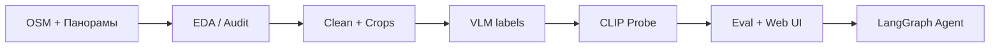

# От панорамы к решению — UTT-классификатор по панорамам

[](https://github.com/mfclabber/aith_junior_ml_contest/actions)

**[Junior ML Contest 2026](https://ai.itmo.ru/junior_ml_contest)** · AI Talent Hub · Дмитрий Новичков

Полноценный ML-проект: **сбор данных → EDA → обучение → eval → веб-пилот → AI-агенты**.

## Задача

Классификация городских участков по уличным панорамам в **6 классов UTT** с веб-интерфейсом для аналитиков и экспортом в GeoPackage.

## Быстрый старт (5 минут)

```bash
git clone https://github.com/mfclabber/aith_junior_ml_contest.git
cd aith_junior_ml_contest
make install
make test              # unit-тесты
make pipeline-quick    # EDA + train на demo-данных (CPU)
make demo              # UI http://127.0.0.1:8765
```

С ML-чекпойнтом: см. [`docs/MODELS.md`](docs/MODELS.md) → `make serve`.

## Полный пайплайн

```bash
cp config/pipeline.env.example .env
# собрать data/dataset (или SKIP_COLLECT=1 если уже есть)
make pipeline
```



Документация: [`docs/PIPELINE.md`](docs/PIPELINE.md)

| Этап | Команда |
|------|---------|
| Установка | `make install` |
| Demo (CPU) | `make pipeline-quick` |
| Продакшен | `make pipeline` |
| Обучение (bash) | `make train` |
| Обучение (Hydra + трекинг) | `make train-cfg` |
| Оценка | `make eval` |
| UI | `make serve` |
| Docker | `make docker` |
| AI-агент | `make agent` |

## MLOps

Стандартный стек: **Hydra** (конфиги `conf/`), **TensorBoard / W&B / MLflow**
(трекинг), **DVC** (`dvc.yaml`), **pre-commit + ruff + black** (качество кода).

```bash
make install-dev
python scripts/train.py model=vit_b32 data=demo tracking=tensorboard   # обучение
make board                                                             # дашборд
```

Подробно: [`docs/MLOPS.md`](docs/MLOPS.md).

## Метрики

| Модель | Accuracy | macro-F1 |
|--------|----------|----------|
| **CLIP ViT-L-14 probe (6 UTT)** | **76.2%** | **61.0%** |
| balanced macro-F1 | — | **73.8%** |

Честная валидация, per-class F1, GPKG: [`docs/METRICS.md`](docs/METRICS.md).

## Структура репозитория

```
├── Makefile                 # единая точка входа
├── conf/                    # Hydra-конфиги (data/model/train/tracking)
├── config/                  # pipeline.env.example
├── dvc.yaml                 # DVC-пайплайн (стадии)
├── pyproject.toml           # ruff/black/pytest
├── .pre-commit-config.yaml  # хуки качества кода
├── data/demo/               # demo для CI и pipeline-quick
├── web_app/                 # Flask UI + ML inference
├── scripts/
│   ├── train.py             # Hydra-точка входа обучения
│   ├── pipeline/            # 01–07 продакшен-шаги
│   ├── data_collection/     # OSM + Яндекс
│   ├── data_quality/        # EDA, clean, VLM relabel
│   ├── training/            # CLIP probe, ensemble, tracking
│   ├── eval/                # benchmark, GPKG compare
│   └── agent/               # LangGraph autonomous agent
├── tests/                   # pytest (CI)
├── docs/                    # PIPELINE, EDA, PRODUCT, METRICS, MLOPS
├── presentation/            # JMLC pitch deck
└── submission/              # PDF для формы конкурса
```

## Критерии JMLC

| # | Критерий | Где в репо |
|---|----------|------------|
| 1 | **Разработка и инженерия** | Git, Docker, CI, `Makefile`, `scripts/pipeline/`, MLOps (Hydra/DVC/трекинг) |
| 2 | **Data Science** | `docs/EDA.md`, audit/clean/val, `docs/METRICS.md` |
| 3 | **Применение ИИ** | `scripts/agent/`, VLM weak supervision |
| 4 | **Продуктовое мышление** | `docs/PRODUCT.md`, `web_app/`, GPKG feedback |
| 5 | **Мотивация** | `submission/pdf/MOTIVATION_LETTER_*.pdf` |

Подробно: [`docs/JMLC_CRITERIA.md`](docs/JMLC_CRITERIA.md).

## Подача на конкурс

Чеклист 3-й волны (до 20 июля 2026) и материалы — в [`SUBMISSION.md`](SUBMISSION.md)
и папке [`submission/`](submission/).

## Контакты

Дмитрий Новичков · novichkovde@pik.ru · [GitHub](https://github.com/mfclabber)
