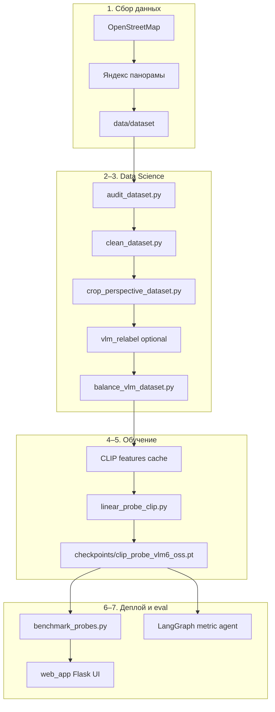

# Полный ML-пайплайн

Воспроизводимый конвейер от сырых панорам до продакшен-классификатора и веб-пилота.

## Схема



## Команды

| Команда | Описание | GPU |
|---------|----------|-----|
| `make install` | venv + зависимости | — |
| `make pipeline-quick` | demo EDA + train на 8 сэмплах | CPU |
| `make pipeline` | полный пайплайн 7 шагов | да |
| `make train` | только шаг 05 | да |
| `make eval` | бенчмарк + GPKG | опц. |
| `make serve` | веб-пилот | инференс |
| `make agent` | автономный metric agent | да |

## Шаги пайплайна

| # | Скрипт | Выход |
|---|--------|-------|
| 01 | `01_collect_data.sh` | `data/dataset/` |
| 02 | `02_eda_audit.sh` | `results/dataset_audit.json` |
| 03 | `03_clean_and_balance.sh` | `metadata_perspective_clean.json`, crops |
| 04 | `04_vlm_relabel.sh` | VLM-метки (если `RUN_VLM_RELABEL=1`) |
| 05 | `05_train_probe.sh` | `checkpoints/clip_probe_vlm6_oss.pt` |
| 06 | `06_evaluate.sh` | `results/probe_benchmark.json` |
| 07 | `07_report.sh` | `results/PIPELINE_REPORT.md` |

## Конфигурация

```bash
cp config/pipeline.env.example .env
# отредактировать CUDA_VISIBLE_DEVICES, пути
source .env
make pipeline
```

## Переменные

| Переменная | По умолчанию | Описание |
|------------|--------------|----------|
| `SKIP_COLLECT` | 0 | Пропустить сбор панорам |
| `RUN_VLM_RELABEL` | 0 | Qwen VLM переразметка (~16GB) |
| `RUN_AGENT` | 0 | LangGraph agent после eval |
| `TARGET_PANORAMAS` | 500 | Цель сбора (демо) |

## Альтернативные пайплайны

- `scripts/run_stable_pipeline.sh` — перебор таксономий 6/5/3 и bottom_crop
- `scripts/run_full_pipeline.sh` — legacy: ResNet + CLIP fine-tune + ensemble
- `scripts/training/train_gpkg_adapt.sh` — fine-tune под метки аналитиков
